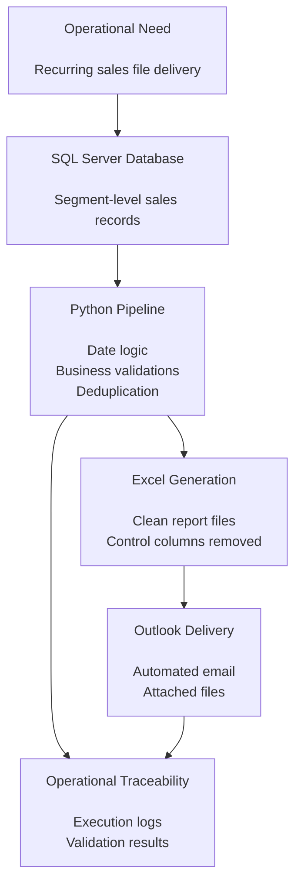
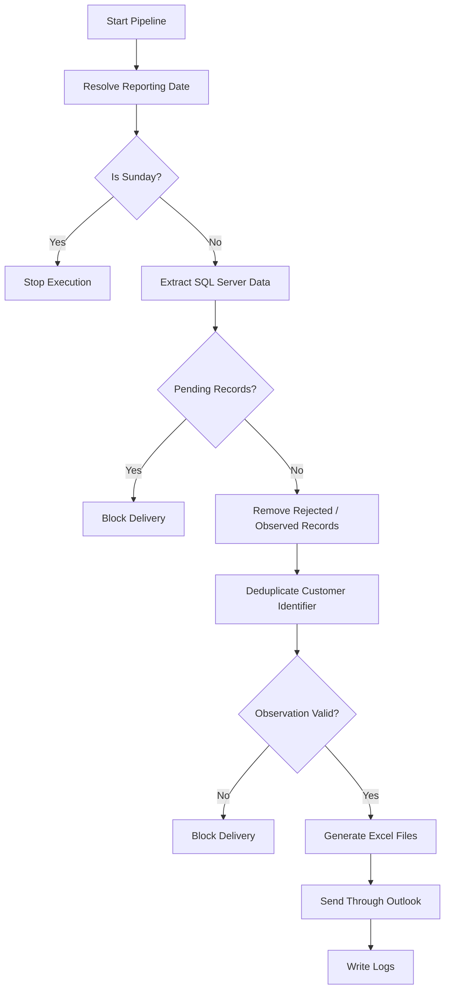
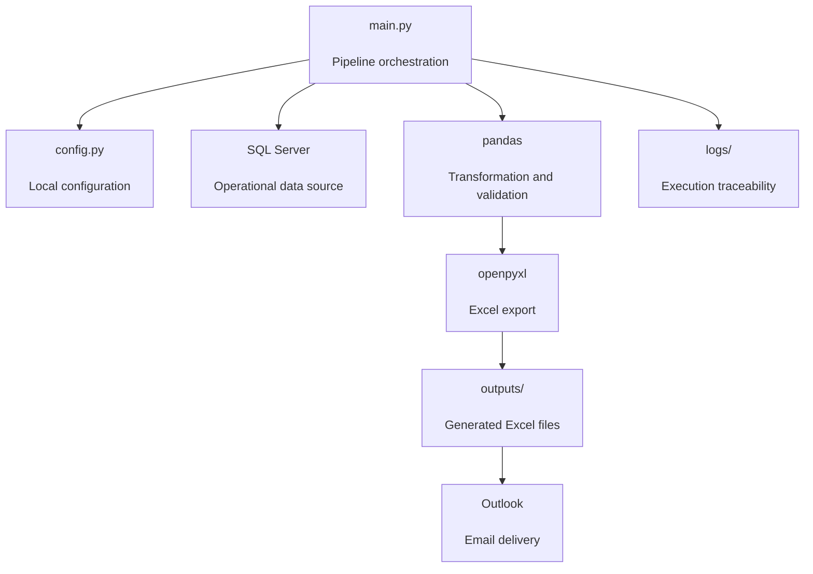

# Sales Report Automation Pipeline

> Python pipeline for recurring sales report automation using SQL Server, pandas, Excel generation, Outlook delivery and operational logging.


##  Executive Summary

Sales Report Automation Pipeline is a sanitized portfolio version of a real-world operational reporting workflow.

The project automates SQL Server extraction, applies business validations, generates Excel files, sends them through Outlook, and records execution logs for operational traceability.

It is designed for recurring sales reporting processes where timing, data quality, validation rules and controlled delivery are critical.

This repository does not include real credentials, internal servers, private table names, real emails, company names, campaign names or production files.

## 🧩 Process Workflow



##  Portfolio Case

| Category | Description |
|---|---|
| Industry | Sales Operations / Call Center / Financial Services |
| Business Area | Operational Reporting |
| Main Problem | Manual recurring sales file preparation |
| Solution Type | Automated reporting pipeline |
| Data Source | SQL Server |
| Output | Excel files |
| Delivery Channel | Microsoft Outlook |
| Target Roles | Data Analyst, BI Analyst, Analytics Engineer Jr |

##  Business Problem

Operational reporting teams often need to prepare recurring sales files under strict timing and quality rules.

The manual process usually involves:

- Selecting the correct reporting date.
- Extracting data from SQL Server.
- Applying operational filters.
- Validating record status.
- Removing rejected or observed records.
- Deduplicating customer identifiers.
- Generating Excel files.
- Sending files to business recipients.
- Keeping evidence of execution.

When this process is manual, it becomes vulnerable to delays, inconsistent filtering, human error and lack of traceability.

This is especially relevant when reports depend on weekday-specific rules, such as processing Saturday data on Mondays and stopping execution on Sundays.

##  Solution Overview

This project implements an end-to-end reporting automation pipeline in Python.

The pipeline:

- Resolves the correct reporting date.
- Stops execution on non-operational days.
- Extracts data from SQL Server by configured segment.
- Blocks delivery when pending records are detected.
- Removes rejected or observed records.
- Deduplicates customer identifiers.
- Validates required observation fields.
- Exports clean Excel files.
- Sends generated files through Outlook.
- Logs each relevant execution step.

`DNI` is used only as a generic example of a customer identifier field. In a production implementation, this field can be renamed or anonymized according to the organization’s data governance standards.

##  Business Value

This automation provides value by:

- Reducing repetitive manual reporting work.
- Improving consistency in recurring sales file delivery.
- Enforcing business validations before file generation.
- Preventing delivery of incomplete or pending records.
- Standardizing Excel report outputs.
- Improving traceability through local logs.
- Reducing operational risk in time-sensitive reporting processes.
- Creating a reusable reporting pattern for other campaigns or business units.

##  Key Features

- SQL Server data extraction.
- Weekday-based reporting date logic.
- Sunday execution blocking.
- Monday processing for Saturday data.
- Segment-level report generation.
- Pending-record validation.
- Rejected and observed record exclusion.
- Duplicate handling by customer identifier.
- Observation field validation.
- Excel file generation with `openpyxl`.
- Outlook email automation with `pywin32`.
- Operational logging.
- Portfolio-safe configuration structure.

##  Business Rules

The pipeline applies operational rules before generating and sending reports.



##  Workflow

1. Resolve the target reporting date.
2. Stop execution on Sundays.
3. Process Saturday data on Mondays.
4. Process previous-day data from Tuesday to Saturday.
5. Extract records from SQL Server for each configured segment.
6. Stop the pipeline if any record is still pending.
7. Remove rejected or observed records.
8. Remove duplicate customer identifiers, keeping the latest record.
9. Validate that observation is not empty or null.
10. Export Excel files without internal control columns.
11. Send the generated files through Outlook.
12. Register operational logs.

##  Technical Architecture



##  Tech Stack

| Technology | Purpose |
|---|---|
| Python | Main automation language |
| pandas | Data transformation and validation |
| pyodbc | SQL Server connectivity |
| SQL Server | Operational data source |
| openpyxl | Excel file generation |
| pywin32 | Outlook desktop automation |
| Outlook | Email delivery channel |
| Logging | Execution traceability |

##  Folder Structure

```text
sales-report-automation-pipeline/
├── main.py
├── config.example.py
├── requirements.txt
├── README.md
├── .gitignore
└── docs/
    └── process_flow.md
```

Local files and folders excluded from the repository:

- `config.py`
- `outputs/`
- `logs/`
- Generated `.xlsx` files
- Virtual environments
- Python cache files
- Local machine paths
- Credentials
- Real recipient emails

##  Output

The pipeline generates Excel files ready for business delivery.

The final files exclude internal control columns and retain only the fields required by the operational report.

Example output logic:

```text
SQL Server extraction
        ↓
Business validations
        ↓
Deduplication
        ↓
Clean Excel export
        ↓
Outlook delivery
```

Generated files are not included in the repository because they may contain operational or sensitive information.

##  Configuration

Copy the example configuration file:

```powershell
Copy-Item config.example.py config.py
```

Then fill `config.py` with your local values:

```python
SQL_SERVER = ""
SQL_DATABASE = ""
SQL_USERNAME = ""
SQL_PASSWORD = ""
SQL_DRIVER = "ODBC Driver 18 for SQL Server"

OUTLOOK_TO = []
OUTLOOK_CC = []
```

`config.py` is intentionally ignored by Git and should never be committed.

##  Installation

Create and activate a virtual environment:

```powershell
python -m venv .venv
.venv\Scripts\activate
```

Install dependencies:

```powershell
pip install -r requirements.txt
```

The machine must have a compatible SQL Server ODBC driver installed.

Recommended:

```text
ODBC Driver 18 for SQL Server
```

##  How to Run

Run the pipeline:

```powershell
python main.py
```

The script will:

1. Resolve the reporting date.
2. Extract data.
3. Apply validations.
4. Generate Excel files.
5. Send the files through Outlook.
6. Register execution logs.

##  Automation

This project can be automated using Windows Task Scheduler.

A typical scheduled execution should:

1. Activate the Python environment.
2. Move to the project directory.
3. Run `python main.py`.
4. Store logs locally.

Recommendations:

- Keep local paths outside the repository.
- Do not include credentials in scheduler scripts.
- Do not include real email recipients in public files.
- Review logs after failed executions.
- Use a dedicated local environment for scheduled execution.

##  Security Notes

- `config.py` is ignored and must be created locally.
- `outputs/` and `logs/` are ignored.
- Generated `.xlsx` files are ignored.
- No credentials are included.
- No real emails are included.
- No internal server names are included.
- No internal table names are included.
- No company, campaign or client names are included.
- No operational paths are included.

##  Possible Extensions

Future improvements may include:

- Environment-based configuration using `.env`.
- HTML email templates.
- Multiple recipient groups by segment.
- Automatic retry logic for Outlook delivery.
- Report delivery through Telegram or Microsoft Teams.
- Cloud storage integration.
- Power BI refresh trigger.
- Centralized logging table in SQL Server.
- Docker-based execution.
- Cloud deployment with Azure Functions or similar services.

##  Disclaimer

This repository is a sanitized portfolio version based on a real-world reporting automation use case.

It does not include internal data, credentials, real emails, internal server names, internal table names, company names, campaign names, production files or operational paths.

The project is intended to demonstrate a reusable automation pattern for recurring operational reporting.

##  Author

**Darwin Camacho**  
Data Analyst | SQL Server | Python | Power BI | Business Intelligence | Sales Analytics

- GitHub: [darwincamacho](https://github.com/darwincamacho)
- LinkedIn: [Darwin Camacho](ADD_LINKEDIN_URL_HERE)
